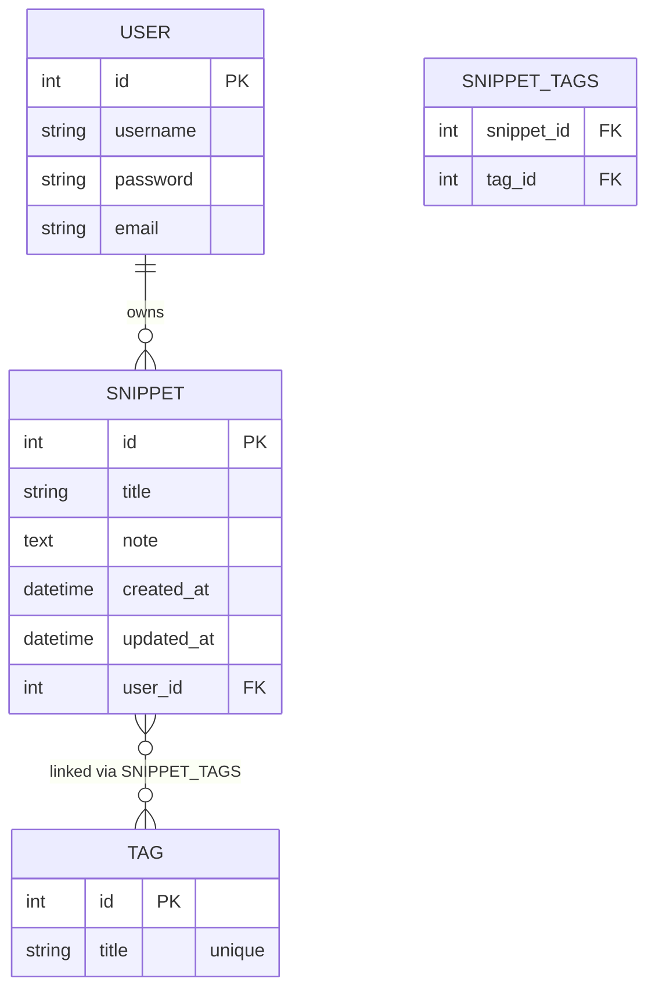

# SnipBox — Database Schema

## Tables

| Table | Columns | Notes |
|---|---|---|
| `auth_user` | id, username, password, email, ... | Django built-in |
| `snippets_tag` | id, title | `title` is UNIQUE |
| `snippets_snippet` | id, title, note, created_at, updated_at, user_id | `user_id` FK → `auth_user` |
| `snippets_snippet_tags` | snippet_id, tag_id | M2M join table |

## Relationships

- A **User** can own many **Snippets** (one-to-many)
- A **Snippet** can have many **Tags** (many-to-many)
- A **Tag** can be shared across many **Snippets** (tag titles are unique — deduplicated at write time)
